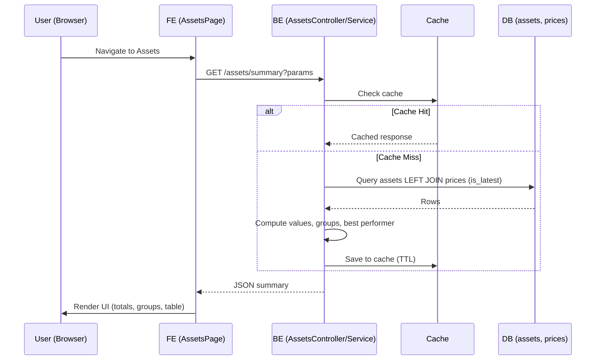

## Architecture — Assets Summary (BE + FE)

References: `docs/PRD-AssetsPageIntegration.md`, `fe/docs/FE-AssetsPage-Spec.md`

### 1) Overview
- Goal: Serve all data for the Assets page via a single backend endpoint `GET /assets/summary`, replacing FE mocks and avoiding per-asset latest price lookups.
- Scope: Backend aggregation of Assets + latest Prices; FE consumes and renders totals, groups, best performer, and table.

### 2) High-Level Design
- Data Source: `assets` table (entity) and `prices` table.
- Latest Price Strategy: Mark one latest price per `asset_id` via `prices.is_latest = TRUE` maintained by a DB trigger and partial unique index. Enables a single indexed join from `assets` to `prices`.
- Caching: Short TTL (30–60s) per filter combination. In-memory by default; optional Redis for multi-instance.
- FE: Fetches `GET /assets/summary`, uses BE enums directly for display, renders existing UI.

### 3) Data Model
- Add column to `prices`:
  - `is_latest BOOLEAN NOT NULL DEFAULT FALSE`
  - Partial unique index: `CREATE UNIQUE INDEX idx_prices_latest_unique ON prices(asset_id) WHERE is_latest;`
- Trigger (concept):
  - On insert:
    - If `NEW.timestamp` is latest for `NEW.asset_id`, set previous latest to FALSE and set `NEW.is_latest = TRUE`.
    - Guard against out-of-order inserts by comparing timestamps.

Example (pseudocode):
```sql
CREATE OR REPLACE FUNCTION set_latest_price()
RETURNS TRIGGER AS $$
BEGIN
  IF NEW.timestamp IS NULL THEN NEW.timestamp := NOW(); END IF;

  IF EXISTS (
    SELECT 1
    FROM prices p
    WHERE p.asset_id = NEW.asset_id AND p.is_latest = TRUE AND p.timestamp > NEW.timestamp
  ) THEN
    NEW.is_latest := FALSE; -- older price, do not flip latest
  ELSE
    UPDATE prices SET is_latest = FALSE WHERE asset_id = NEW.asset_id AND is_latest = TRUE;
    NEW.is_latest := TRUE;
  END IF;
  RETURN NEW;
END;
$$ LANGUAGE plpgsql;

DROP TRIGGER IF EXISTS trg_set_latest_price ON prices;
CREATE TRIGGER trg_set_latest_price
BEFORE INSERT ON prices
FOR EACH ROW EXECUTE FUNCTION set_latest_price();
```

Backfill plan:
1) For each `asset_id`, set `is_latest = TRUE` on row with max(`timestamp`).
2) Enforce uniqueness via partial index.

### 4) API Design (BE)
- Route: `GET /assets/summary`
- Auth: Same guard as other assets endpoints.
- Query params:
  - `includeInactive?: boolean` (default: false)
  - `types?: string` CSV of AssetType values
- Response shape: See PRD and FE spec. Includes `totals`, `bestPerformer`, `groups`, `assets[]` with `details.*` fields.
- Errors: 400 on invalid params; 200 with empty arrays for no data; 500 for server errors.
- Swagger: Provide request/response schemas and examples.

### 5) Service Logic (BE)
- `AssetsService.getSummary(params)`
  1) Build query for `assets` using filters (`includeInactive`, `types`).
  2) Left join to latest price:
     - `LEFT JOIN prices p ON p.asset_id = a.id AND p.is_latest = TRUE`
  3) For each asset row:
     - `currentPrice = p.price` when available
     - `currentValue = details.shares * currentPrice` if shares and price present; else fallback `details.currentValue`
     - `performancePct = ((currentPrice - purchasePrice) / purchasePrice) * 100` when shares and purchasePrice present; otherwise null
  4) Aggregate:
     - `totals`: sum of per-asset currentValue, counts
     - `groups`: by `type`, each with count and totalValue (sum currentValue)
     - `bestPerformer`: max `performancePct` (non-null)
  5) Cache: store full response by cache key (filters) for TTL.

Example TypeORM join (concept):
```ts
const qb = this.assetRepo
  .createQueryBuilder('a')
  .leftJoin('prices', 'p', 'p.asset_id = a.id AND p.is_latest = TRUE');
// + where clauses for filters
```

### 6) Caching Strategy
- Default: in-memory cache with TTL from env `ASSETS_SUMMARY_TTL` (default 60s).
- Redis cache: Out of scope for now; may be considered later.
- Cache key: `assets-summary:v1:{includeInactive}:{types_sorted_csv}`.
- Admin bypass (optional): header `x-bypass-cache: true`.

### 7) Frontend Integration
- Service method: `getAssetsSummary({ includeInactive?, types? })` in `fe/src/services/assetService.ts`.
- Optional hook using TanStack Query with `queryKey=['assets-summary', params]` and `staleTime=30s`.
- Mapping:
  - None required; FE uses `AssetType` and `Risk` enums exactly as defined by BE.
- UI updates in `fe/src/pages/AssetsPage.tsx`:
  - Replace mocks with `data.assets`.
  - Summary cards use `data.totals` and `data.bestPerformer`.
  - Category cards use `data.groups`.
  - Table uses `data.assets` and computes per-row performance only when sufficient fields exist.
- i18n: Ensure keys exist; add missing keys listed in FE spec.

### 8) Security
- Reuse existing authentication guard for assets endpoints.
- Validate/whitelist `types` query values against known enums.
- No sensitive data returned.

### 9) Observability
- Logs:
  - Cache hits/misses with key.
  - Query timing for summary join.
  - Count of assets processed.
- Metrics (optional): p95 latency for cold/hot paths.

### 10) Performance & Scalability
- Indexes: partial unique on latest, plus `(asset_id, timestamp DESC)` for safety.
- p95 targets: ≤150ms warm cache at ~1k assets; ≤300ms cold typical.
- Future: materialized view for heavy aggregations if needed; invalidate/refresh cadence.

### 11) Testing
- Unit (BE):
  - Computation of `currentValue` and `performancePct` under edge conditions.
  - Group aggregation correctness.
  - Cache behavior (keying, TTL).
- Controller (BE):
  - Filters, 200/400 responses, Swagger examples.
- Migration tests:
  - Exactly one `is_latest=TRUE` per `asset_id` after insert.
  - Backfill correctness.
- FE tests:
  - Render with mocked `AssetsSummaryResponse` verifying totals, groups, table.

### 12) Deployment & Migration
1) Deploy migration: add `is_latest` column.
2) Backfill latest flags.
3) Create partial unique index.
4) Create trigger function + trigger.
5) Deploy API code (reads `is_latest`).
6) Configure cache env (`ASSETS_SUMMARY_TTL`, optional Redis).

Rollback:
- Drop trigger, index, then column.

### 13) Risks & Mitigations
- Out-of-order price inserts: timestamp guard in trigger; maintenance job if bulk backfills.
- Enum mismatches: FE mapping helpers.
- Cache staleness: TTL ≤60s; admin bypass header.

### 14) Sequence Diagram



