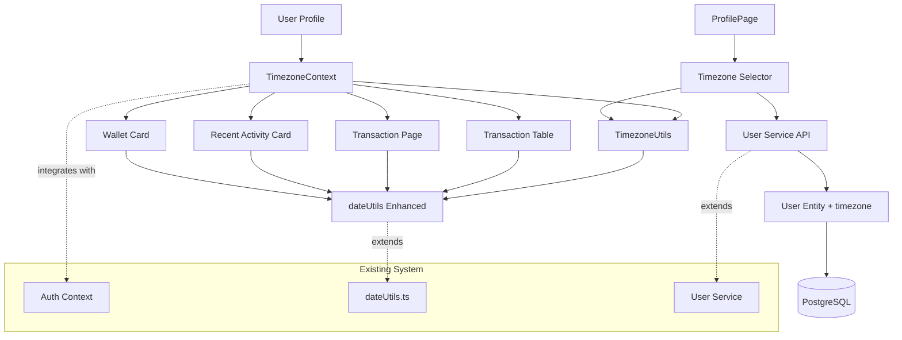

# CFPM Timezone Management Enhancement Architecture

## Introduction

This document outlines the architectural approach for enhancing CFPM with comprehensive timezone management functionality. Its primary goal is to serve as the guiding architectural blueprint for AI-driven development of new features while ensuring seamless integration with the existing system.

**Relationship to Existing Architecture:**
This document supplements existing project architecture by defining how timezone components will integrate with current systems. Where conflicts arise between new and existing patterns, this document provides guidance on maintaining consistency while implementing enhancements.

### Existing Project Analysis

Based on comprehensive analysis of the CFPM codebase, I've identified the following characteristics of your existing system:

**Current Project State:**
- **Primary Purpose:** Comprehensive Financial Portfolio Management application enabling users to track wallets, portfolios, assets, and transactions with real-time market data integration
- **Current Tech Stack:** NestJS 11.x (Backend), React 18+ TypeScript (Frontend), PostgreSQL with TypeORM 0.3.x, Docker containerization
- **Architecture Style:** Modular monolith with clear separation between backend services and React component-based frontend, RESTful API communication
- **Deployment Method:** Docker containerization with automated deployment pipeline support

**Available Documentation:**
- Comprehensive PRD and technical documentation suite in docs/ folder
- Swagger API documentation integrated with NestJS controllers
- Existing database schema documented in database.dbml
- Component-based frontend architecture with established UI patterns

**Identified Constraints:**
- Must maintain UTC storage in database for data consistency
- Must preserve existing API contracts for external integrations
- Must maintain performance characteristics on date-heavy pages (TransactionPage)
- Must follow established user preference patterns (locale/currency model)
- Must ensure backward compatibility for existing users

### Change Log

| Change | Date | Version | Description | Author |
|--------|------|---------|-------------|---------|
| Initial Architecture | 2025-01-16 | 1.0 | Created timezone management enhancement architecture | Winston (Architect) |

## Enhancement Scope and Integration Strategy

**Enhancement Overview:**
- **Enhancement Type:** New Feature Addition (Timezone Management)
- **Scope:** User timezone preferences with display conversion throughout application
- **Integration Impact:** Medium - requires coordinated updates across user model, utilities, and all date display components

**Integration Approach:**
- **Code Integration Strategy:** Extend existing user preference patterns, create new timezone utilities alongside existing dateUtils.ts, incrementally update components without breaking changes
- **Database Integration:** Add single timezone column to existing users table via TypeORM migration with default 'UTC' value
- **API Integration:** Extend existing user DTOs and endpoints, no new API surface required
- **UI Integration:** Follow established ProfilePage patterns, extend existing date display components with timezone awareness

**Compatibility Requirements:**
- **Existing API Compatibility:** All endpoints maintain UTC ISO 8601 timestamp format, no breaking changes to external integrations
- **Database Schema Compatibility:** Continue storing all timestamps in UTC, only add user preference column
- **UI/UX Consistency:** Maintain existing DD/MM/YYYY Vietnamese locale formatting, follow established Select component patterns
- **Performance Impact:** <100ms latency requirement with timezone conversion caching strategy

## Tech Stack Alignment

### Existing Technology Stack

| Category | Current Technology | Version | Usage in Enhancement | Notes |
|----------|-------------------|---------|---------------------|-------|
| Backend Framework | NestJS | 11.x | User entity updates, DTO extensions | Core framework remains unchanged |
| Frontend Framework | React | 18+ | Timezone context provider, component updates | Use existing hooks patterns |
| TypeScript | TypeScript | Latest | Full typing for timezone operations | Maintain strict typing standards |
| Database | PostgreSQL | Latest | Single column addition to users table | UTC storage patterns unchanged |
| ORM | TypeORM | 0.3.x | Migration for timezone column | Existing entity patterns followed |
| Validation | class-validator | Current | IANA timezone validation | Extend existing DTO validation |
| UI Components | Custom UI Library | Current | Timezone selector using existing Select | Maintain design system consistency |
| API Documentation | Swagger/OpenAPI | Current | Document timezone field additions | Extend existing API docs |

### New Technology Additions

| Technology | Version | Purpose | Rationale | Integration Method |
|------------|---------|---------|-----------|-------------------|
| date-fns-tz | Latest | Timezone conversion utilities | Robust timezone handling with DST support | New utility module alongside existing dateUtils |

## Data Models and Schema Changes

### New Data Models

#### User Entity Extension
**Purpose:** Add timezone preference to existing user model
**Integration:** Extend existing User entity with single additional field

**Key Attributes:**
- timezone: VARCHAR(50) - IANA timezone identifier (e.g., 'Asia/Ho_Chi_Minh')
- Default value: 'UTC' for backward compatibility and new users

**Relationships:**
- **With Existing:** No new relationships, simple field addition to existing User entity
- **With New:** No new entities required, timezone is purely a user preference field

### Schema Integration Strategy

**Database Changes Required:**
- **New Tables:** None required
- **Modified Tables:** users table (add timezone column)
- **New Indexes:** None required initially (single column lookup)
- **Migration Strategy:** TypeORM migration with default value assignment and rollback capability

**Backward Compatibility:**
- Default 'UTC' value ensures existing users experience no change until they set preference
- All existing queries and operations continue unchanged
- No data transformation required, only schema addition

## Component Architecture

Based on analysis of your existing CFPM architecture patterns - modular NestJS services, React hooks-based components, and service layer separation - the new timezone components will follow the same established patterns.

### New Components

#### TimezoneUtils Service
**Responsibility:** Timezone conversion utilities and IANA timezone validation
**Integration Points:** Used by dateUtils extension and React components for timezone conversion

**Key Interfaces:**
- convertToUserTimezone(utcDate: string, timezone: string): Date
- formatInUserTimezone(utcDate: string, timezone: string, format: string): string
- validateTimezone(timezone: string): boolean
- getTimezoneList(): TimezoneOption[]

**Dependencies:**
- **Existing Components:** dateUtils.ts for format patterns
- **New Components:** None (standalone utility)

**Technology Stack:** TypeScript utility module with date-fns-tz for timezone operations

#### TimezoneContext Provider
**Responsibility:** Application-wide timezone state management and user preference access
**Integration Points:** Integrates with existing AuthContext to provide timezone from user profile

**Key Interfaces:**
- TimezoneContext: { userTimezone: string, setUserTimezone: (tz: string) => void }
- useTimezone() hook for component access

**Dependencies:**
- **Existing Components:** AuthContext for user profile access
- **New Components:** TimezoneUtils for validation

**Technology Stack:** React Context API following existing AuthContext patterns

#### Profile Timezone Selector
**Responsibility:** UI component for timezone selection integrated into ProfilePage
**Integration Points:** Uses existing Select components and profile save workflow

**Key Interfaces:**
- TimezoneSelector component with search and common timezone prioritization
- Integrates with existing profile form validation and save mechanisms

**Dependencies:**
- **Existing Components:** ProfilePage, Select UI components, profile save service
- **New Components:** TimezoneUtils for timezone list and validation

**Technology Stack:** React TypeScript component using existing UI component library

#### Enhanced Date Display Components
**Responsibility:** Convert existing date display components to use user timezone
**Integration Points:** Update TransactionTable, TransactionPage, RecentActivityCard, WalletCard components

**Key Interfaces:**
- Enhanced formatDateDDMMYYYY() with timezone parameter
- Timezone-aware time display functions
- Backward compatible with existing component interfaces

**Dependencies:**
- **Existing Components:** All existing date display components and dateUtils
- **New Components:** TimezoneUtils and TimezoneContext

**Technology Stack:** React TypeScript components with enhanced date formatting utilities

### Component Interaction Diagram



## API Design and Integration

### API Integration Strategy
**API Integration Strategy:** Extend existing user profile endpoints with timezone field, maintain RESTful patterns
**Authentication:** Use existing JWT authentication, no changes to auth flow
**Versioning:** No API versioning required, backward-compatible field addition

### New API Endpoints

No new endpoints required. Enhancement extends existing user profile endpoints:

#### Enhanced User Profile Response
- **Method:** GET
- **Endpoint:** `/users/profile` (existing)
- **Purpose:** Include timezone field in existing user profile response
- **Integration:** Extend existing UserResponseDto and CurrentUserResponseDto

**Request:**
```json
{
  "headers": {
    "Authorization": "Bearer <existing_jwt_token>"
  }
}
```

**Response:**
```json
{
  "firstname": "string",
  "lastname": "string", 
  "username": "string",
  "email": "string",
  "locale": "vi",
  "currency": "VND",
  "timezone": "Asia/Ho_Chi_Minh"
}
```

#### Enhanced User Profile Update
- **Method:** PUT
- **Endpoint:** `/users/profile` (existing)
- **Purpose:** Accept timezone field in existing profile update
- **Integration:** Extend existing UpdateUserDto with timezone validation

**Request:**
```json
{
  "firstname": "string",
  "lastname": "string",
  "locale": "vi", 
  "currency": "VND",
  "timezone": "Asia/Ho_Chi_Minh"
}
```

**Response:**
```json
{
  "message": "Profile updated successfully"
}
```

## Source Tree Integration

### Existing Project Structure
```
CFPM/
├── be/                           # NestJS Backend
│   ├── src/
│   │   ├── users/                # User management module
│   │   │   ├── entities/user.entity.ts
│   │   │   ├── dto/create-user.dto.ts
│   │   │   ├── users.service.ts
│   │   │   └── users.controller.ts
│   │   └── migrations/           # Database migrations
├── fe/                           # React Frontend  
│   ├── src/
│   │   ├── lib/utils/
│   │   │   └── dateUtils.ts      # Existing date utilities
│   │   ├── contexts/
│   │   │   └── AuthContext.tsx   # Existing auth context
│   │   ├── pages/
│   │   │   └── ProfilePage.tsx   # User profile page
│   │   └── components/shared/
│   │       ├── TransactionTable.tsx
│   │       └── RecentActivityCard.tsx
```

### New File Organization
```
CFPM/
├── be/
│   ├── src/
│   │   ├── users/
│   │   │   ├── entities/user.entity.ts     # Modified: add timezone field
│   │   │   ├── dto/create-user.dto.ts      # Modified: add timezone validation
│   │   │   ├── dto/update-user.dto.ts      # Modified: add timezone field
│   │   │   └── users.service.ts            # Modified: handle timezone updates
│   │   └── migrations/
│   │       └── 1673884800000-AddTimezoneToUser.ts  # New migration file
├── fe/
│   ├── src/
│   │   ├── lib/utils/
│   │   │   ├── dateUtils.ts                # Modified: add timezone-aware functions  
│   │   │   └── timezoneUtils.ts            # New: timezone conversion utilities
│   │   ├── contexts/
│   │   │   ├── AuthContext.tsx             # Existing
│   │   │   └── TimezoneContext.tsx         # New: timezone context provider
│   │   ├── pages/
│   │   │   └── ProfilePage.tsx             # Modified: add timezone selector
│   │   └── components/shared/
│   │       ├── TransactionTable.tsx        # Modified: use timezone-aware dates
│   │       ├── TransactionPage.tsx         # Modified: convert calendar dates
│   │       ├── RecentActivityCard.tsx      # Modified: timezone-aware timestamps
│   │       └── WalletCard.tsx             # Modified: convert timestamp displays
```

### Integration Guidelines
- **File Naming:** Follow existing camelCase for utilities, PascalCase for React components
- **Folder Organization:** Place timezone utilities in lib/utils alongside existing dateUtils, contexts in contexts folder
- **Import/Export Patterns:** Use existing barrel export patterns, maintain module boundaries

## Infrastructure and Deployment Integration

### Existing Infrastructure
**Current Deployment:** Docker containerization with automated deployment pipeline
**Infrastructure Tools:** Docker, PostgreSQL database, RESTful API architecture
**Environments:** Development, staging, production environments with existing CI/CD

### Enhancement Deployment Strategy
**Deployment Approach:** Leverage existing Docker containerization and deployment pipeline
**Infrastructure Changes:** None required - enhancement uses existing database and application infrastructure
**Pipeline Integration:** Database migration runs automatically on deployment through existing TypeORM migration process

### Rollback Strategy
**Rollback Method:** Database migration rollback capability with timezone column removal
**Risk Mitigation:** Default 'UTC' values ensure existing functionality continues during partial rollbacks
**Monitoring:** Enhanced logging for timezone conversion errors with UTC fallback monitoring

## Coding Standards and Conventions

### Existing Standards Compliance
**Code Style:** TypeScript strict mode, ESLint configuration for both backend and frontend
**Linting Rules:** Follow existing ESLint configuration with no-any enforcement, React hooks rules
**Testing Patterns:** Jest for backend unit tests, React Testing Library for frontend component tests
**Documentation Style:** JSDoc comments for functions, README updates for feature documentation

### Enhancement-Specific Standards
- **Timezone Function Naming:** Prefix timezone-related functions with 'timezone' or 'tz' (e.g., timezoneFormatDate)
- **Error Handling Pattern:** Always provide UTC fallback for timezone conversion failures
- **Context Usage Pattern:** Use timezone context through useTimezone() hook, avoid direct context import

### Critical Integration Rules
- **Existing API Compatibility:** All API responses maintain existing UTC timestamp format, timezone only affects display
- **Database Integration:** Continue UTC storage, timezone field only affects user preferences and display conversion
- **Error Handling:** Implement graceful fallback to UTC display for any timezone conversion errors
- **Logging Consistency:** Use existing logging patterns, add timezone-specific error logging for monitoring

## Testing Strategy

### Integration with Existing Tests
**Existing Test Framework:** Jest for backend, React Testing Library + Jest for frontend testing
**Test Organization:** Tests co-located with components, separate test directory for integration tests
**Coverage Requirements:** Maintain existing coverage standards, ensure new timezone code is covered

### New Testing Requirements

#### Unit Tests for New Components
- **Framework:** Jest (existing)
- **Location:** Co-located with timezone utilities and components
- **Coverage Target:** 90% coverage for timezone conversion logic
- **Integration with Existing:** Use existing test setup and mock patterns

#### Integration Tests
- **Scope:** Profile timezone update workflow, timezone context integration with auth context
- **Existing System Verification:** Ensure existing user profile operations continue unchanged
- **New Feature Testing:** Verify timezone conversion accuracy across all display components

#### Regression Tests
- **Existing Feature Verification:** Automated test suite verifying all existing date displays continue working
- **Automated Regression Suite:** Add timezone conversion tests to existing CI pipeline
- **Manual Testing Requirements:** Manual verification of timezone display accuracy across major user workflows

## Security Integration

### Existing Security Measures
**Authentication:** JWT-based authentication system
**Authorization:** Role-based access control through existing user system
**Data Protection:** Existing data validation and sanitization patterns
**Security Tools:** class-validator for input validation, existing SQL injection protection

### Enhancement Security Requirements
**New Security Measures:** IANA timezone validation to prevent injection attacks through timezone field
**Integration Points:** Timezone validation integrated with existing class-validator patterns
**Compliance Requirements:** No additional compliance requirements, timezone preference is user display setting

### Security Testing
**Existing Security Tests:** Continue existing authentication and authorization test coverage
**New Security Test Requirements:** Validate timezone field input sanitization and IANA timezone list validation
**Penetration Testing:** Include timezone field in existing security testing procedures

## Next Steps

### Story Manager Handoff

Ready for Story Manager to implement the timezone management enhancement with these key requirements:

- **Architecture Reference:** This document provides complete integration blueprint validated against existing CFPM codebase
- **Integration Requirements:** Must follow existing user preference patterns, extend ProfilePage using established UI components, maintain UTC storage
- **System Constraints:** Preserve existing API contracts, maintain <100ms performance requirement, ensure backward compatibility
- **Implementation Sequence:** Story 1.1 (Backend) → Story 1.2 (Frontend Utilities) → Story 1.3 (Profile UI) → Story 1.4 (Apply to Components)
- **Integrity Checkpoints:** Each story includes integration verification to ensure existing functionality remains intact

### Developer Handoff

Developer implementation guidelines based on validated architecture:

- **Architecture Standards:** Follow existing NestJS service patterns for backend, React hooks patterns for frontend
- **Integration Requirements:** Extend existing user entity and DTOs, use established UI component library patterns
- **Technical Decisions:** Use date-fns-tz for timezone operations, implement timezone context following AuthContext patterns
- **Compatibility Verification:** Test existing date displays continue working, verify API responses maintain UTC format
- **Implementation Sequence:** Backend schema changes first, frontend utilities second, UI integration third, component updates last to minimize risk

**Next Action:** Begin implementation with Story 1.1 (Backend Timezone Support) following the detailed acceptance criteria in the PRD.
